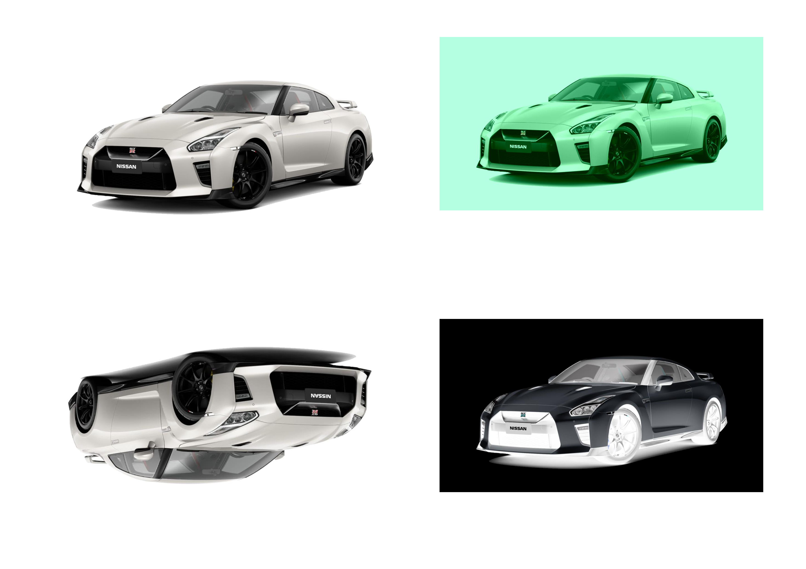

<h1>Image Manipulation - Java Project</h1>
 
<h3>Features</h3>
<ul>
    <li>Returns a 2D array of integers that contains every pixel from the image stored as int hexadecimal values containing the RGBA values for the pixel</li>
    <li>Converts the 2D array of int pixel data into an image and saves it</li>
    <li>Extract the color components from the hexadecimal value for the pixel.</li>
    <li>Converts the array of red, green, blue, and alpha values back into a hexadecimal value</li>
    <li>Extracting a 3x3 section from the top left of the image</li>
    <li>View the structure of the image data in both the raw pixel form and the extracted RGBA form</li>
    <li>Negative Version of the Image</li>
    <li>Stretch the Image Horizontally</li>
    <li>Shrink the Image Vertically</li>
    <li>Invert the Image</li>
    <li>Applying a Color Filter</li>
    <li>Painting an Image of Random Colors</li>
    <li>Drawing a Rectangle on an Image</li>
    <li>Create Abstract Geometric Art</li>
</ul>

<h2>Acknowledgments</h2>

<b>Java: http://bit.ly/java-certifications<b>
 

<h2>Photo</h2>

 

<h2>Contact</h2>

<b> Email: mariusc0023@gmail.com </b>
